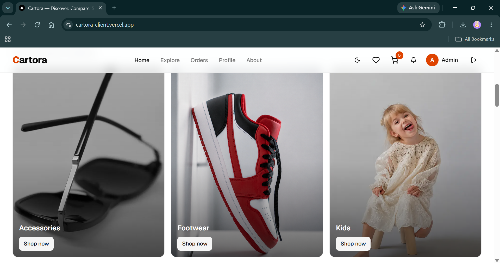

# 🛒 Cartora — Modern E-Commerce Platform (Client)

A full-featured, modern e-commerce storefront built with **Next.js 16**, **React 19**, **TypeScript**, and **Google Gemini AI**. Cartora delivers a next-generation shopping experience with intelligent AI concierge assistance, multi-product comparison studio, AI cart optimization, real-time product insights, dark/light theme support, Stripe-powered checkout, and a full admin dashboard with AI listing generation and analytics.

> **🔗 Live Demo:** [cartora-client.vercel.app](https://cartora-client.vercel.app)
>
> **🔗 Backend API:** [cartora-server.vercel.app](https://cartora-server.vercel.app)

---

## 🤖 AI-Powered Shopping Experience (Google Gemini)

Cartora integrates four flagship customer-facing AI features powered by **Google Gemini** with multi-model fallback and direct live MongoDB catalog grounding, plus an admin-facing generative product copilot:

### 1. 💬 AI Shopping Concierge (`Floating Global Assistant`)
- **Conversational Product Discovery** — Site-wide conversational assistant that understands natural language queries, buyer needs, budget constraints, and aesthetic preferences.
- **Catalog Grounding & Live Recommendations** — Recommends real, in-stock products with live pricing, stock indicators, and clickable product mini-cards directly in the chat stream.
- **Dynamic Suggested Prompts** — Offers contextual quick-reply chips based on the shopper's current location and dialogue state.

### 2. 🔍 AI Product Insights & Match Score (`Product Detail Page`)
- **Buyer Match Scoring (0–100%)** — Computes an instant compatibility score tailored to product specifications and customer feedback.
- **Pros & Cons Breakdown** — Synthesizes hundreds of technical specs and verified buyer reviews into digestible highlights and trade-offs.
- **"Ideal For" Profiling & Verdict** — Identifies exact target use-cases (e.g., *Power Users*, *Frequent Travelers*, *Value Seekers*) with an honest, unbiased buyer verdict.

### 3. ⚖️ AI Comparison Studio (`/compare`)
- **Head-to-Head Multi-Product Matrix** — Compare 2 to 4 products simultaneously with side-by-side spec alignment and real-time attribute diffing.
- **Priority-Driven Analysis** — Adapts scoring and verdicts according to the shopper's declared priority (*Budget*, *Performance*, *Longevity*, *Everyday Use*).
- **Dimensional Scoring & Winner Badges** — Generates dimensional scores across Build Quality, Performance, Value, and Usability, awarding badges like *Best Overall*, *Best Value*, and *Top Performer*.

### 4. 🛒 AI Cart Optimizer & Synergy Advisor (`/cart`)
- **Cart Synergy & "Vibe" Score** — Evaluates active cart items for compatibility, completeness, and accessory synergy with an overall cart score.
- **Free Shipping & Threshold Strategy** — Monitors free shipping milestones and suggests precise, low-cost add-on recommendations from the live catalog to unlock free delivery.
- **Bundle & Savings Advice** — Provides intelligent companion suggestions and discount bundle opportunities before proceeding to checkout.

---

### ✍️ Bonus: AI Product Copilot (`Admin /items/add & /items/edit`)
- **Automated Listing Generation** — Generates complete, SEO-friendly product titles, rich descriptions, category matches, pricing/compare-at suggestions, SKUs, bullet highlights, tags, and technical specs from rough notes or bullet points.

---

## 📸 Screenshot



---

## 🚀 Technologies Used

| Layer        | Technology                                                    |
| ------------ | ------------------------------------------------------------- |
| Framework    | [Next.js 16](https://nextjs.org/) (App Router, Turbopack)     |
| Language     | [TypeScript](https://www.typescriptlang.org/)                 |
| UI Library   | [React 19](https://react.dev/)                                |
| Styling      | [Tailwind CSS 4](https://tailwindcss.com/)                    |
| AI Engine    | [Google Gemini API](https://ai.google.dev/) (Flash Family)    |
| State/Data   | [TanStack React Query 5](https://tanstack.com/query)          |
| Forms        | [React Hook Form](https://react-hook-form.com/) + [Zod](https://zod.dev/) |
| Payments     | [Stripe Elements](https://stripe.com/docs/stripe-js)         |
| Animations   | [Framer Motion](https://www.framer.com/motion/)               |
| Charts       | [Recharts](https://recharts.org/)                             |
| Icons        | [Lucide React](https://lucide.dev/)                           |
| Theming      | [next-themes](https://github.com/pacocoursey/next-themes)    |
| Toasts       | [Sonner](https://sonner.emilkowal.dev/)                       |
| HTTP Client  | [Axios](https://axios-http.com/)                              |
| Auth         | [Google OAuth](https://www.npmjs.com/package/@react-oauth/google) |
| Deployment   | [Vercel](https://vercel.com/)                                 |

---

## ✨ Core Features

### 🛍️ Customer Features
- **AI Shopping Concierge** — Site-wide interactive AI shopping assistant with live catalog recommendations
- **AI Product Insights** — Instant 0–100% Buyer Match Score, pros & cons, and honest verdicts on PDPs
- **AI Comparison Studio** — Multi-product versus matrix with dynamic dimensional scoring and winner badges
- **AI Cart Optimizer** — Cart synergy score, free shipping threshold helper, and bundle recommendations
- **Product Catalog** — Browse, search, and filter products with category-based navigation
- **Product Detail Pages** — Image galleries, size charts, variant selection, reviews
- **Shopping Cart & Wishlist** — Real-time totals, quantity controls, and saved items
- **Secure Checkout** — Stripe-powered card payments with address management
- **Order Tracking & User Dashboard** — Order history, live status updates, and profile management
- **Dark / Light Mode** — System-aware theme toggle with smooth transitions

### 🔐 Admin Features
- **AI Product Copilot** — One-click generation of SEO titles, descriptions, specs, and pricing
- **Analytics Dashboard** — Revenue charts, order frequency graphs, category breakdowns (Recharts)
- **Product Management** — Full CRUD: add, edit, delete products with image uploads
- **Order Management** — View all orders, update statuses (processing → shipped → delivered)
- **Real-Time Notifications** — Instant alerts when customers complete purchases

### 🎨 Design & UX
- **Responsive Design** — Mobile-first, works on all screen sizes
- **Micro-Animations** — Framer Motion page transitions and hover effects
- **Premium UI Components** — Custom button, card, input, and dialog components
- **SEO Optimized** — Meta tags, semantic HTML, Open Graph support

---

## 📦 Dependencies

### Production
| Package                          | Purpose                         |
| -------------------------------- | ------------------------------- |
| `next` (16.2.10)                 | React framework (App Router)    |
| `react` / `react-dom` (19.2.4)  | UI library                      |
| `@tanstack/react-query` (5.x)   | Server state management         |
| `axios` (1.x)                   | HTTP client for API calls       |
| `@stripe/react-stripe-js` (6.x) | Stripe payment elements         |
| `@stripe/stripe-js` (9.x)       | Stripe.js loader                |
| `framer-motion` (12.x)          | Animation library               |
| `recharts` (3.x)                | Chart/graph components          |
| `react-hook-form` (7.x)         | Form state management           |
| `zod` (4.x)                     | Schema validation               |
| `next-themes` (0.4.x)           | Dark/light mode                 |
| `sonner` (2.x)                  | Toast notifications             |
| `lucide-react` (1.x)            | Icon library                    |
| `class-variance-authority`       | Component variant styling       |
| `clsx` / `tailwind-merge`       | Conditional class utilities     |
| `@react-oauth/google`           | Google sign-in                  |

### Development
| Package                        | Purpose                    |
| ------------------------------ | -------------------------- |
| `tailwindcss` (4.x)           | Utility-first CSS          |
| `@tailwindcss/postcss`        | PostCSS plugin             |
| `typescript` (5.x)            | Type safety                |
| `eslint` / `eslint-config-next` | Linting                  |
| `prettier`                     | Code formatting            |

---

## 🛠️ Getting Started

### Prerequisites
- **Node.js** ≥ 18
- **npm** or **yarn**
- A running instance of the [Cartora Server](https://github.com/actuallyayon/cartora-server)

### 1. Clone the repository
```bash
git clone https://github.com/actuallyayon/cartora-client.git
cd cartora-client
```

### 2. Install dependencies
```bash
npm install
```

### 3. Configure environment variables
Create a `.env.local` file in the project root:
```env
NEXT_PUBLIC_API_URL=http://localhost:5000/api
NEXT_PUBLIC_STRIPE_PUBLISHABLE_KEY=pk_test_your_stripe_key
NEXT_PUBLIC_GOOGLE_CLIENT_ID=your_google_client_id
```

### 4. Run the development server
```bash
npm run dev
```

The app will be available at **http://localhost:3000**.

### 5. Build for production
```bash
npm run build
npm start
```

---

## 📂 Project Structure

```
src/
├── app/                    # Next.js App Router pages
│   ├── (auth)/             # Login & Register pages
│   ├── (dashboard)/        # User/Admin dashboard
│   ├── about/              # About page
│   ├── cart/               # Shopping cart & AI Cart Optimizer
│   ├── checkout/           # Stripe checkout flow
│   ├── compare/            # AI Product Comparison Studio
│   ├── explore/            # Product catalog & search
│   ├── items/              # Admin product management & AI Copilot
│   ├── products/           # Product detail pages & AI Insights
│   └── ...                 # Other static & legal pages
├── components/
│   ├── shared/             # Global headers, footers, theme toggle
│   └── ui/                 # Reusable UI primitives (Button, Card, Dialog, etc.)
├── features/               # Feature-based architecture
│   ├── ai/                 # AI Concierge, Copilot, Insights, Compare Studio & Cart Optimizer
│   ├── analytics/          # Admin analytics & KPI dashboards
│   ├── auth/               # Authentication hooks & Google OAuth
│   ├── cart/               # Cart state & TanStack Query hooks
│   ├── catalog/            # Product listing & detail components
│   ├── notification/       # Notification bell & real-time alerts
│   ├── orders/             # Order processing & tracking hooks
│   ├── reviews/            # Reviews, ratings & review form
│   ├── wishlist/           # Wishlist hooks & persistence
│   └── ...
├── lib/                    # Shared utilities (Axios instance, formatters, cn)
└── providers/              # React Query, Theme, and Auth providers
```

---

## 🔗 Links & Resources

| Resource       | URL                                                                 |
| -------------- | ------------------------------------------------------------------- |
| 🌐 Live Site   | [cartora-client.vercel.app](https://cartora-client.vercel.app)      |
| 🖥️ Backend API | [cartora-server.vercel.app](https://cartora-server.vercel.app)      |
| 📦 Client Repo | [github.com/actuallyayon/cartora-client](https://github.com/actuallyayon/cartora-client) |
| 📦 Server Repo | [github.com/actuallyayon/cartora-server](https://github.com/actuallyayon/cartora-server) |

---

## 📄 License

This project is open source and available under the [MIT License](LICENSE).
